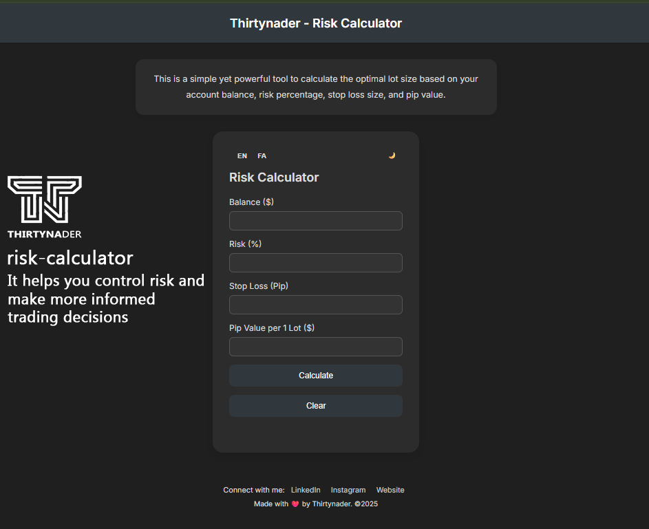

# 🧮 Risk Calculator - Lot Size Estimator

A simple and effective risk management tool for forex traders.  
This web-based calculator helps you determine the optimal lot size based on your balance, risk %, stop loss, and pip value.

🌐 **Live Demo:**  
[https://thirtynader.github.io/Thirtynader-risk_calculator/](https://thirtynader.github.io/Thirtynader-risk_calculator/)

> Designed with ❤️ by [Thirtynader](https://www.1hesekhob.com/pages/Thirtynader/)

---

## 📌 Features

- ✅ Calculate optimal **lot size** for any trading scenario
- 🌙 **Dark mode by default** (switchable to light)
- 🌐 **Multi-language support:** English 🇬🇧 / Persian 🇮🇷
- 📱 Responsive design – works perfectly on mobile & desktop
- 💾 Saves language and theme preferences in browser
- 🎯 Lightweight, no dependencies

---
📥 Download the latest version of the calculator here:  
👉 [Download ZIP](https://github.com/Thirtynader/Thirtynader-risk_calculator/releases/latest)

## 🚀 How to Use

1. Enter your:
   - **Account Balance ($)**
   - **Risk Percentage (%)**
   - **Stop Loss Size (Pips)**
   - **Pip Value per 1 Lot ($)**
2. Click **"Calculate"**
3. Get your optimal **Lot Size**
4. Optionally: clear the fields, toggle dark/light mode, or switch languages.

---

## 🖼️ Screenshot



---

## 🛠️ Tech Stack

- HTML5
- CSS3 (with custom variables)
- Vanilla JavaScript (no frameworks)
- Google Fonts: Inter & Vazirmatn

---

## 🔧 Customization

You can easily customize:

- 💡 **Default Language:**  
  Edit `const savedLang = localStorage.getItem('lang') || 'en';`

- 🌓 **Default Theme (Dark/Light):**  
  Already set to dark by default:
  ```javascript
  const savedDark = localStorage.getItem('darkMode') !== '0';
  if (savedDark) document.body.classList.add('dark');
